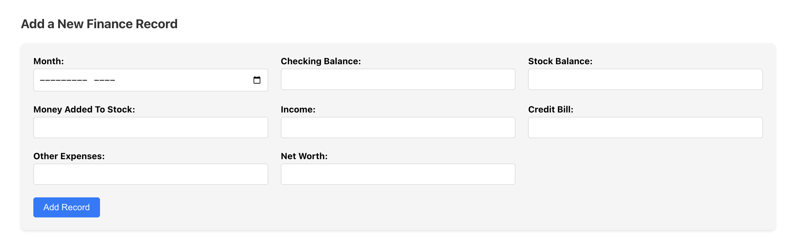
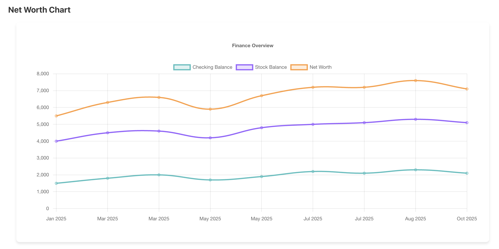

# Paper Trail

## Table of Contents
1. [Introduction](#introduction)
2. [Features](#features)
3. [Technologies](#technologies)
4. [Installation](#installation)
5. [Endpoints](#endpoints)
6. [Screenshots](#screenshots)
7. [Contact](#contact)

## Introduction

A personal finance tracking web app built with PostgreSQL, Flask, and React. Paper Trail allows users to easily track their income, expenses, and budget, providing a clear view of their cash flow. The app intends to deliver insights and charts for the user to become financially literate.

## Features

- Add, edit, and view finance records (e.g., checking balance, stock balance, expenses).
- Data is stored in a PostgreSQL database for persistent storage.
- Frontend built with React for an interactive user experience.
- Flask API to manage backend operations.

## Technologies

- **Frontend**: React, Chart.js
- **Backend**: Flask
- **Database**: PostgreSQL
- **Version Control**: Git and GitHub

## Installation

To run this project locally, follow the steps below:

### Prerequisites

- Python 3.x
- Node.js
- PostgreSQL
- Git

### Setup

1. **Clone the repository**:

   ```bash
   git clone https://github.com/krish-thakker/Paper-Trail.git
   cd Paper-Trail
   ```

2. **Backend Setup** (Flask):

   - Install the required Python packages:

     ```bash
     pip install -r requirements.txt
     ```

   - Set up the PostgreSQL database and configure environment variables:

     ```bash
     DB_NAME=your_database_name
     DB_USER=your_database_user
     DB_PASSWORD=your_database_password
     ```

   - Initialize PostgreSQL database by running:
   
     ```bash
     python init_db.py
     ```

3. **Frontend Setup** (React):

   - Navigate to the `frontend` directory:

     ```bash
     cd frontend
     ```

   - Install the required Node.js dependencies:

     ```bash
     npm install
     npm install react@18.0.0 react-dom@18.0.0
     npm install chart.js@3.9.1 react-chartjs-2
     ```

4. **Run the Backend**:

   - From the root directory, run the Flask server:

     ```bash
     flask run
     ```

   The backend should now be running on `http://127.0.0.1:5000`.

5. **Run the Frontend**:

   - From the `frontend` directory, start the React development server:

     ```bash
     npm start
     ```

   The frontend should now be running on `http://localhost:3000`.

6. **Access the application**:

   Open your browser and go to `http://localhost:3000` to interact with the application.

## Endpoints

Here are the available API endpoints in the backend:

### **GET /api/finances**
Retrieves all finance records from the database.

### **POST /api/finances**
If month entered has an existing record, the record is updated. Otherwise, a new record is created. The request body should contain the following fields:

```json
{
  "month": "2025-01",  // Year and month in YYYY-MM format (stored as 2025-01-01 in the database)
  "checking_balance": 1500.50,  // Checking account balance
  "stock_balance": 2500.75,  // Stock account balance
  "income": 3000.00,  // Income for the month
  "credit_bill": 200.00,  // Credit bill amount
  "other_expenses": 400.00,  // Other expenses for the month
  "money_added": 500.00  // Amount added to the stock account
}

```

### **GET /api/chart**
Generates a chart of checking balance over time, returning an image in PNG format.

### **GET /api/projected_growth**
Provides projections for stock growth over a specified timeframe. Query parameters include:

- **principal**: The initial investment (default is 10,000).
- **months**: The number of months for projection (default is 12).

Example Request:

```bash
GET /api/projected_growth?principal=10000&months=12
```

## Error Handling
- Invalid data or missing fields will result in an error message and HTTP status code 400.
- Database or internal server errors are handled with an appropriate error message and HTTP status code 500.

## Screenshots
Here are some screenshots of the application:





## Contact

For questions or issues, feel free to reach out to me via email: [kthakker00@gmail.com](mailto:kthakker00@gmail.com).